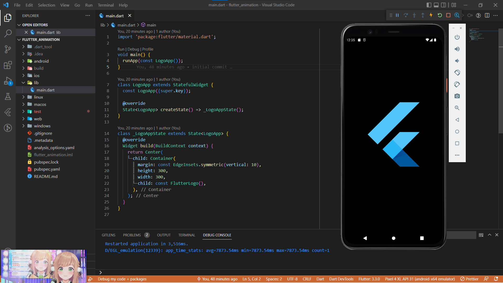
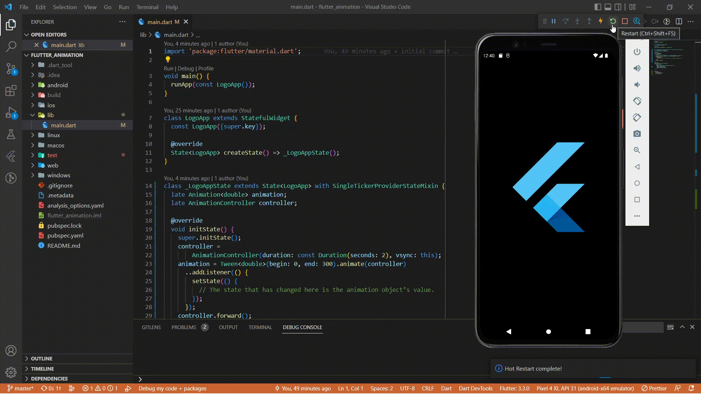
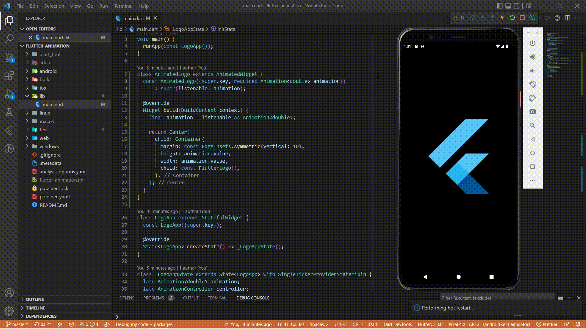
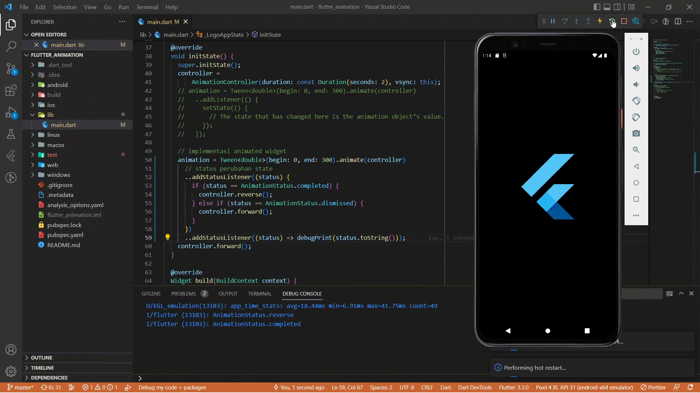
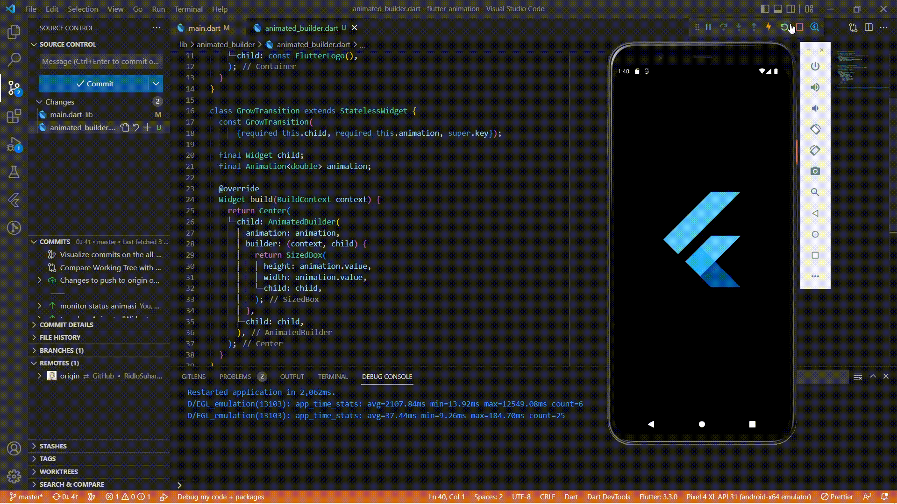
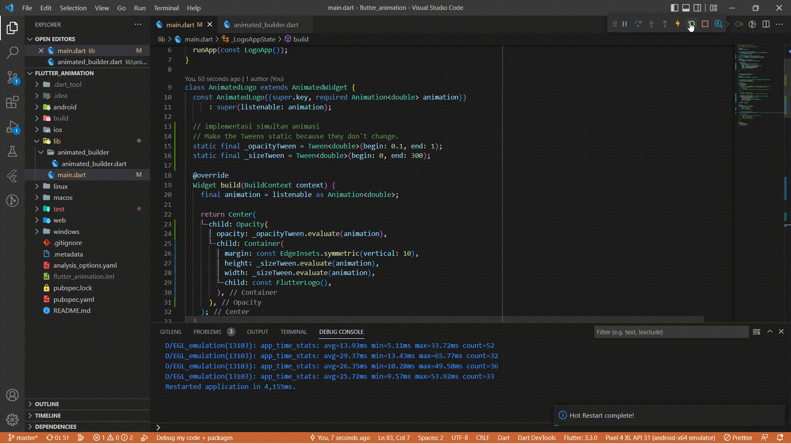

# flutter_animation

A new Flutter project.

## Hasil Praktikum

        class widget LogoApp

        import 'package:flutter/material.dart';

        void main() => runApp(const LogoApp());

        class LogoApp extends StatefulWidget {
        const LogoApp({super.key});

        @override
        State<LogoApp> createState() => _LogoAppState();
        }

        class _LogoAppState extends State<LogoApp> {
        @override
        Widget build(BuildContext context) {
            return Center(
            child: Container(
                margin: const EdgeInsets.symmetric(vertical: 10),
                height: 300,
                width: 300,
                child: const FlutterLogo(),
            ),
            );
        }
        }

- Rendering animations

    

- Simplifying with Animated­Widget

    

- Monitoring the progress of the animation

    

- Refactoring with AnimatedBuilder

    

- Simultaneous animations

    
